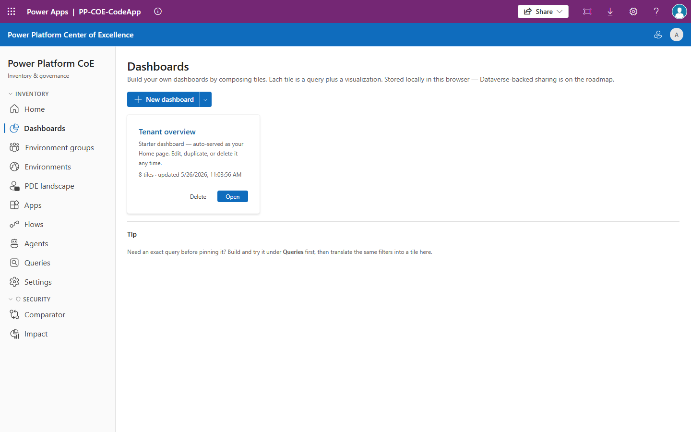
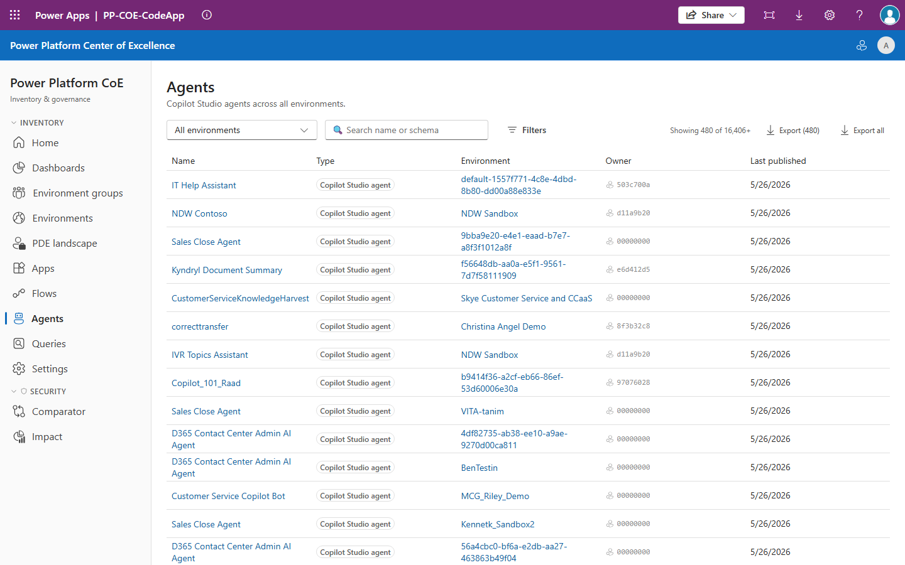
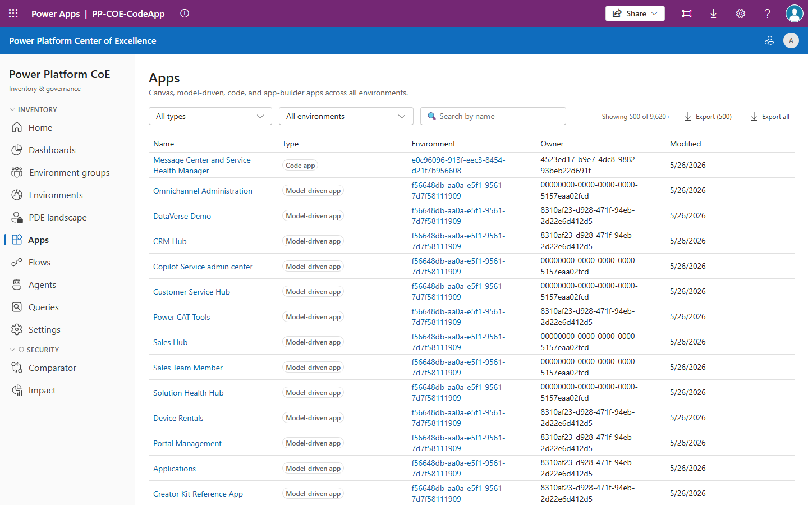
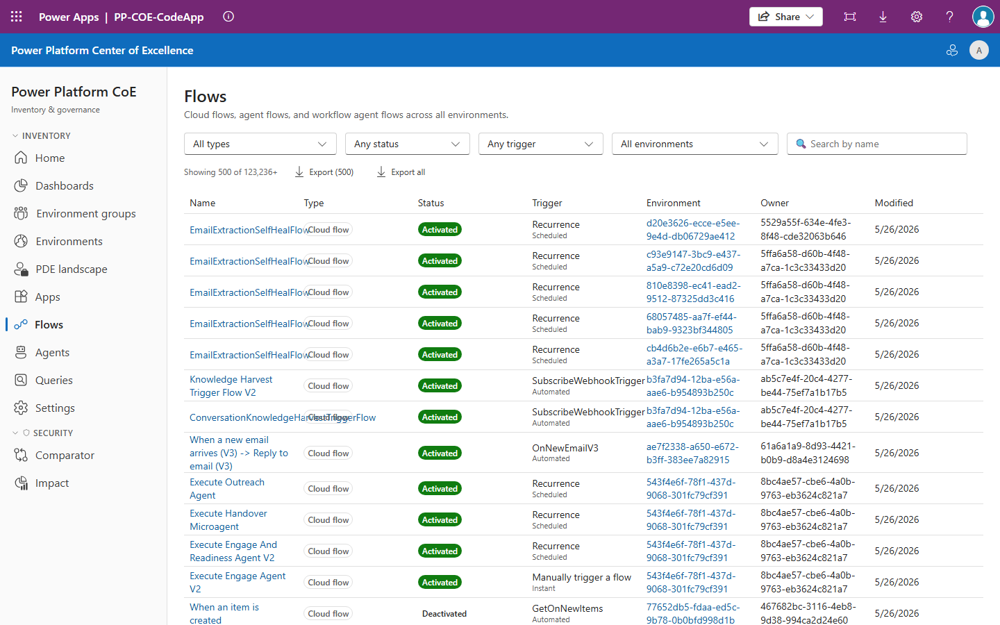
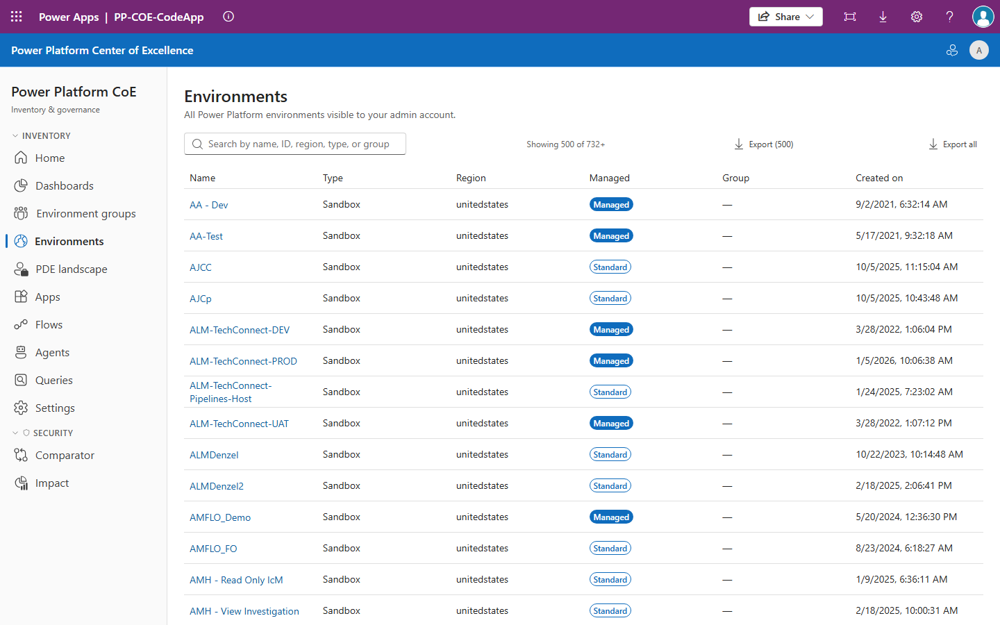
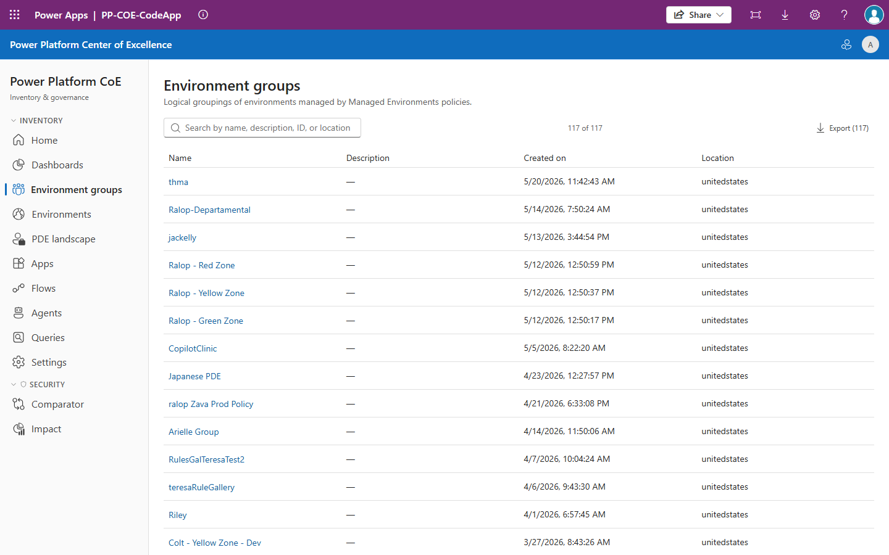
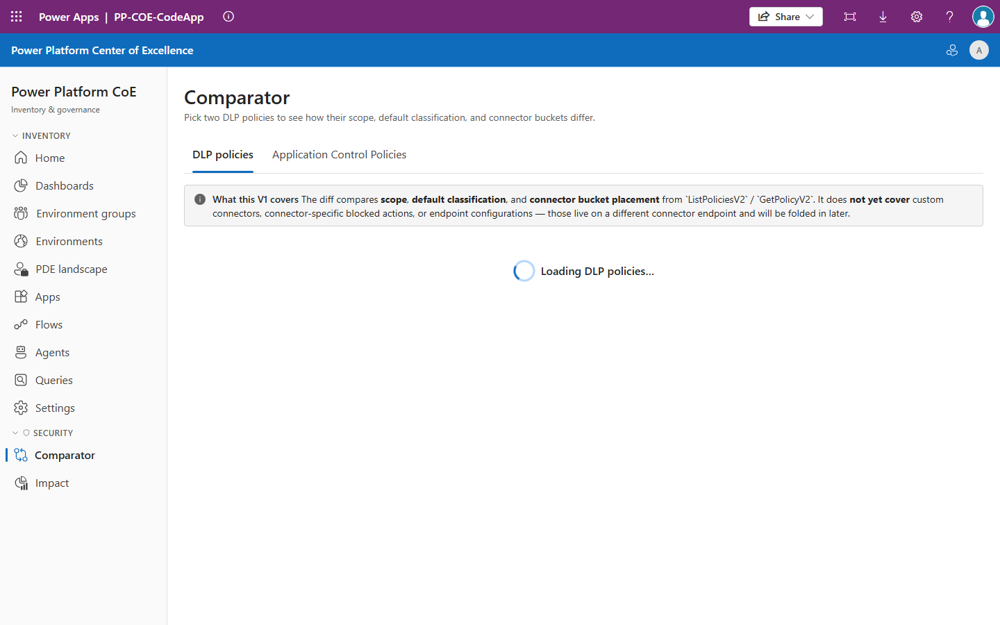
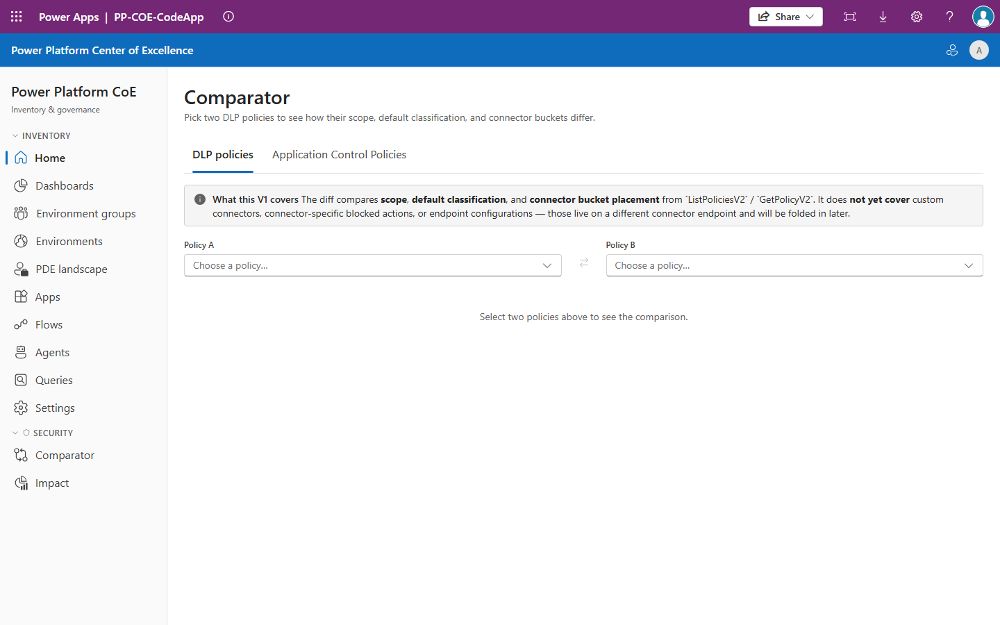

# Power Platform CoE — Code App

**A tenant-wide inventory and governance console for your Power Platform Center of Excellence, delivered as a Power Apps Code App.**

It runs *inside* the Power Apps player — no external hosting, no separate auth, no
data warehouse to stand up — and reads your tenant's live inventory directly
through the **Power Platform for Admins V2** connector. Open it the way you open
any other app in `make.powerapps.com`, and you get a fast, modern admin surface
over every environment, app, flow, agent, connector, and DLP policy in the
tenant.

> Built with React 19 + TypeScript + Vite + Fluent UI v9, packaged as a managed
> Power Platform solution (`PPCoECodeApp`).



---

## Why this exists

If you run a Power Platform Center of Excellence, you already know the problem:
**the platform grows faster than your ability to see it.** Makers spin up apps,
flows, and Copilot Studio agents across dozens — sometimes hundreds — of
environments. Ownership decays as people change teams and leave the company. DLP
policies drift apart environment by environment. And the question "what do we
actually have, who owns it, and what breaks if we change a policy?" turns into a
multi-day spreadsheet exercise.

The Microsoft CoE Starter Kit answers a lot of this, but it's a heavy install:
sync flows, Dataverse tables, scheduled jobs, and a data lag between reality and
what you see. **This app takes a different bet.** It asks the tenant
admin APIs *live*, on demand, from inside a Code App — so there's almost nothing
to deploy, nothing to keep in sync, and what you see is what's true right now.

**Who it's for:** CoE leads, platform admins, and governance teams who need to
*see, search, and act on* tenant inventory without building a data pipeline
first.

### What you get out of it

- **Real-time inventory** — no sync lag, no nightly jobs. Every list reflects the tenant as it is this minute.
- **Near-zero infrastructure** — it's a Code App in a managed solution. Import it, wire one connection, done.
- **Governance you can act on** — find orphaned resources, compare and clone DLP policies, and model policy blast radius *before* you enforce.
- **Answers, not just lists** — build dashboards, run templated queries, and scan deep properties across the whole tenant.
- **One hop to the right portal** — every detail page deep-links to the maker studio, PPAC, or Copilot Studio for the resource you're looking at.

---

## What it does

The app is organized the way a CoE admin thinks: **browse your resources**,
**get insights**, and **manage risk & governance**.

### 📚 Resource explorer — see everything, drill into anything

Browse every resource type the tenant exposes, each with a consistent
paginated list and a rich detail page:

| Resource | What you see |
|---|---|
| **Apps** | Canvas, model-driven, code, and app-builder apps — owner, environment, type, premium/connector usage |
| **Flows** | Cloud flows and agent flows with owner and environment |
| **Agents** | Copilot Studio agents (first-party Dynamics `msdyn_*` agents filtered out so counts stay honest) |
| **Environments** | Every environment with type, region, and group membership |
| **Environment groups** | Managed environment groups, their members, and the governance rules applied to them |
| **Connectors** | The tenant connector catalog with licensing **tier** (premium/standard) and publisher |

Every **detail page** gives you the full picture in one place:

- **Owner resolution** done right — owner/creator GUIDs are resolved against Entra ID, and the app correctly distinguishes a *deleted user* from a *guest*, a *service principal / Enterprise Application*, or a *managed identity*. (An `aaduser` miss is **not** "deleted user" — and the app knows the difference.)
- **Portal actions bar** — context-aware deep links that jump you straight to the Power Apps maker, Power Automate maker, Copilot Studio, or the Power Platform Admin Center for *this exact* resource.
- **Connectors used**, with premium flagging.
- **Supplemental admin details** — licensing posture, embedded-app type, DLP evaluation — fetched on demand from the admin connector (never as part of the bulk load).
- **Raw JSON** of the underlying inventory payload, one accordion away.
- A **Cmd/Ctrl+K user lookup** to paste any GUID and resolve who it is.







### 📈 Insights — turn inventory into answers

- **Dashboards** — build your own. Multi-tab dashboards with seven tile types (KPI, table, bar, pie, line, combo, stacked bar). Tiles are configured visually with a query builder, written as raw clauses, or computed client-side over nested data (e.g., connector usage). KPI tiles support trend sparklines and percent-change badges. No PowerApps maker required — it's all in the app.
- **Queries** — a templated query builder for the questions CoE admins ask constantly ("show me everything using any premium connector," "find every resource of type X"). Templates include *dynamic* ones generated live from the connector catalog, so "premium" always means premium *today*. Save your own, export to CSV.
- **Tenant scans (deep inventory)** — go beyond what the standard lists show. Fan out across the whole tenant (or one environment group, or one environment) and surface *deep* properties — embedded-app type, premium-API usage, licensing posture — with a filter builder, a column picker, and CSV export. The property catalog is **forward-compatible**: it pairs hand-curated, friendly fields with an *observed* schema auto-discovered from live responses, so when Microsoft adds a new admin field you can query it the next day without a code change. A drift detector flags when curated fields stop showing up.
- **PDE landscape** — a view over personal developer / default-environment sprawl.

### 🛡️ Risk & governance — find and fix the problems

- **Ownerless resources** — a tenant-wide scan that buckets every owner into health categories: *unresolved* (deleted user — the ~95% case), *service principal* (with Microsoft-first-party vs. custom-SP distinction and the SP's escalation contacts), *disabled* (departed employee in grace period), *guest*, *active*, and well-known *sentinel* placeholders. Orphaned resources block environment clones and represent real governance debt — this finds them at tenant scale and exports each bucket to CSV.

### 🔒 DLP & ACP — policy tooling that prevents outages

Three tools that turn DLP from a manual, side-by-side PPAC chore into something
you can reason about:

- **Comparator** — a side-by-side diff of two DLP policies: scope, default classification, and per-connector bucket placement, with divergences highlighted. Catch policy drift before it causes inconsistent enforcement.
- **Impact** — *before-you-break-it* analysis. Pick a policy and see exactly which apps, flows, and agents in scope use the connectors it would block (or already-unmanaged custom connectors). Quantify the blast radius before you enforce.
- **Duplicator** — clone an existing DLP policy's connector buckets and default classification verbatim to one or more target environments in a couple of clicks, instead of hand-rebuilding it in PPAC.




### 🧩 Zones *(experimental, behind a feature flag)*

A personal, drag-and-drop organizational layer on top of environment groups —
the parent hierarchy Microsoft doesn't ship. Arrange Managed environment groups
and your own custom "standard" groups on a Kanban board, link DLP policies, and
roll up reporting per zone.

### 🤖 CoE Assistant *(experimental, behind a feature flag, off by default)*

An optional floating chat panel wired to a Microsoft Copilot Studio agent, for
AI-assisted help navigating inventory and governance workflows. Ships **dark** —
when the flag is off, nothing renders and the connector is never contacted, so
it's safe for orgs with Copilot policy restrictions.

---

## How it works

```
                 Power Apps player (browser, in an iframe)
                 ┌──────────────────────────────────────────┐
                 │   PP CoE Code App (React 19 + Fluent v9)  │
                 │                                           │
   Admin gate ▶  │   feature slices: apps · flows · agents · │
   (preflight    │   environments · dashboards · security · │
    permission   │   queries · tenant-scans · zones · …      │
    probe)       │                  │                        │
                 │        shared/inventory-core (runQuery)   │
                 │   LRU cache · throttle · 429 retry · paging│
                 └──────────────────┬────────────────────────┘
                                    │  Power Platform for Admins V2
                                    ▼      (+ Entra / Graph for owners)
                          Live tenant inventory
```

**The engine.** Everything sits on top of `shared/inventory-core`, a small query
engine that wraps the connector's `QueryResources` API. It builds clauses,
executes them, and adds the production-hardening the raw API lacks: an **LRU
cache** (with opt-in longer TTLs and a `forceFresh` bypass), **request
throttling**, automatic **429 retry with jittered backoff**, and a workaround for
the connector's unreliable pagination (it always sends *both* `SkipToken` and
`Skip`, and treats `skipToken` as authoritative). Every call returns a typed
`DataResult<T>` so errors surface as UI panes instead of crashes.

**Preflight access gate.** On boot the app probes for admin access and classifies
failures precisely — a 403 routes you to a PIM-activation prompt, a 401 to a
"connection broken" pane, transient 429/503/network errors auto-retry — so you
never stare at a blank screen wondering whether it's you or the tenant.

**Feature-slice architecture.** The code is organized *vertically by feature*,
not horizontally by layer. Each feature owns its data, views, and routes behind a
single public `index.ts`; features may use `shared/*` but never reach into each
other. ESLint boundaries and CI enforce it, which keeps the blast radius of any
change small and predictable. See
[`.github/copilot-instructions.md`](.github/copilot-instructions.md) for the full
contributor guide.

---

## Repo layout

```
PP-CodeApp-CoE/
├── PP-CoE-CodeApp/           # The Power Apps Code App (React 19 + TS + Vite + Fluent UI v9)
│   ├── src/
│   │   ├── app/              # shell: router, providers, TopBar, SideNav
│   │   ├── features/         # vertical slices: apps, flows, agents, environments,
│   │   │                     #   dashboards, security, queries, deep-inventory, zones, …
│   │   ├── shared/           # inventory-core (the engine), deep-inventory catalog,
│   │   │                     #   ui, portal-actions, user-lookup, connector-catalog
│   │   ├── generated/        # auto-generated connector clients — DO NOT hand-edit
│   │   └── featureFlags/     # cross-cutting feature flags
│   └── docs/                 # schema samples, payload samples, integration guides
├── solution/                 # Unpacked Power Platform solution (PPCoECodeApp)
│   ├── src/                  # Tracked: Solution.xml, Customizations.xml, *.meta.xml
│   └── out/                  # (gitignored) Packed solution zips
├── scripts/
│   ├── pack-solution.mjs     # Build the Code App + pack the solution zip
│   └── pull-solution.mjs     # Re-sync solution/src/ from Dataverse
└── .github/workflows/        # CI, CodeQL, release
```

---

## Getting started

### Install it from a release (admins)

The Code App ships as a managed Power Platform solution. To stand it up in a
tenant:

1. Download the latest managed solution zip from
   [Releases](../../releases).
2. Import it into a Dataverse environment (maker portal → **Solutions** →
   **Import**, or `pac solution import`).
3. In the solution's **Connection References**, set the **Power Platform for
   Admins V2** connection (created with an account that has tenant admin / PIM
   access).
4. Open the **PP CoE Code App** from the apps list. The preflight gate confirms
   access on first load.

For pulling cloud changes back into git, building self-contained zips, and how
the release workflow ships managed solutions, see
[`solution/README.md`](solution/README.md).

### Run it locally (contributors)

```powershell
cd PP-CoE-CodeApp
npm install            # installs deps + auto-heals generated connectors via postinstall
npm run dev            # local dev server on :5173, accessed through the Power Apps player
```

Common commands (run from `PP-CoE-CodeApp/`):

```powershell
npm run lint           # ESLint (incl. feature-boundary rules)
npx tsc --noEmit       # type-check
npm run build          # tsc -b && vite build
npm run test:run       # Vitest, single CI run
npm test               # Vitest in watch mode
```

CI (lint + type-check + build + tests) runs on every push/PR via
[`ppcoecodeapp-ci.yml`](.github/workflows/ppcoecodeapp-ci.yml); CodeQL runs on
push/PR and weekly via
[`ppcoecodeapp-codeql.yml`](.github/workflows/ppcoecodeapp-codeql.yml).

---

## Reference docs

The `PP-CoE-CodeApp/docs/` folder holds the hard-won, paid-for-once knowledge
behind the app. Read the relevant one before changing the matching area:

- **[Inventory schema samples](PP-CoE-CodeApp/docs/inventory-schema-samples.md)** —
  real `properties` payloads for every resource type, plus the clause-builder
  gotchas. Includes the canonical
  [Owner / creator GUID resolution](PP-CoE-CodeApp/docs/inventory-schema-samples.md#owner--creator-guid-resolution)
  callout. **Read this before adding any owner lookup, ownerless filter, or
  maker-attribution rollup.**
- **[Portal actions engine](PP-CoE-CodeApp/docs/portal-actions.md)** — the
  registry-driven command bar on each detail page. Read before adding a new
  portal button.
- **[Admin connector inventory](PP-CoE-CodeApp/docs/admin-connector-inventory.md)** &
  **[Admin payload samples](PP-CoE-CodeApp/docs/admin-payload-samples.md)** — the
  on-demand, per-record admin-connector enrichments (and the two governance
  models for env groups).
- **[Governance rules catalog](PP-CoE-CodeApp/docs/governance-rules-catalog.md)** —
  the full schema reference for every known environment-group rule.
- **[Copilot Studio integration](PP-CoE-CodeApp/docs/copilot-studio-integration.md)** —
  how the optional CoE Assistant chat is wired and feature-flag-gated.
- **[Connector generator fixup](PP-CoE-CodeApp/docs/connector-generator-fixup.md)** —
  why `src/generated/` is auto-healed on `npm install` and must not be
  hand-edited.
- **[Roadmap](PP-CoE-CodeApp/docs/roadmap.md)** — the parking lot of ideas not
  yet built, each with enough context to start cold.

---

## Status & expectations

This is a **prototype** that demonstrates building a custom CoE on live inventory
data — and it's grown into a genuinely useful one. It reads tenant inventory in
real time and offers targeted write actions (e.g., DLP policy duplication); it is
not a replacement for the full Microsoft CoE Starter Kit's historical analytics
and automation. Treat it as a fast, modern admin surface that complements your
existing governance tooling. Features marked *experimental* (Zones, CoE
Assistant) ship behind feature flags and default off.

---

## License

See [LICENSE](LICENSE).
